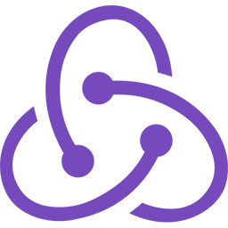
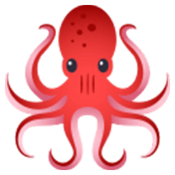
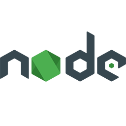
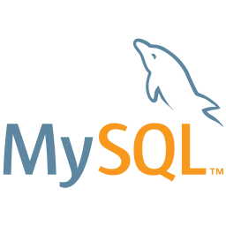
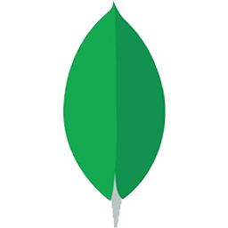
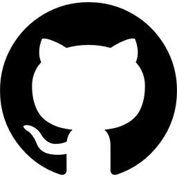

# Hello, I'm Lourenço Lage!

### About me

- 🧔🏽 I'm 30 years old, brazilian living in Belo Horizonte - MG
- 🌱 I’m currently taking a Full Stack Development course at [Trybe](https://www.betrybe.com/)
- 👯 I’m looking for job oportunities as a software developer
- 🥅 2021 Goals: Complete the Software Developer course I'm enrolled in: [Trybe](https://www.betrybe.com/)
- 📚 Always improving my programming and communication skills
- ⚡ I love technology, video games, and also interested in psychology, sociology and geopolitcs.

### Languages and Tools

 

### Connect with me

 

### GitHub Stats

<!--
** This is a ✨ _special_ ✨ repository because its `README.md` (this file) appears on your GitHub profile.

Here are some ideas to get you started:

- 🔭 I’m currently working on ...
- 🌱 I’m currently learning ...
- 👯 I’m looking to collaborate on ...
- 🤔 I’m looking for help with ...
- 💬 Ask me about ...
- 📫 How to reach me: ...
- 😄 Pronouns: ...
- ⚡ Fun fact: ...
-->